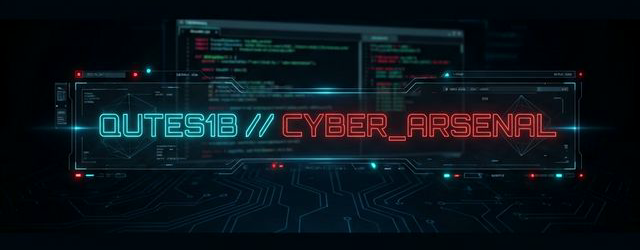

<p align="center">
  
</p>

<h1 align="center">Qutes1b - Tactical Qutebrowser Configuration</h1>

<p align="center">
  
  
  
  
</p>

---

A highly customized Qutebrowser setup designed for security operators and red teamers. This configuration focuses on performance, aesthetics, and a tactical workflow.

## 🚀 Versions

### 🛡️ 1. Main Branch (Standard Edition)
The core configuration for daily use.
- **Theme**: Clean dark mode with subtle accents.
- **Dashboard**: Minimalist link hub with system stats.
- **Features**: Essential keyboard shortcuts for research and browsing.

### ⚡ 2. V2 Branch (S1BARCH Tactical Edition)
The advanced, mission-oriented overhaul.
- **Branding**: S1BARCH.CYBER_OPS identity.
- **Visuals**: Premium glassmorphism UI, transparent tabs, cyberpunk aesthetics.
- **Dashboard**: Live threat intel, interactive terminal, and mission (TODO) list.
- **GOD Tier Keybindings**: 50+ search engines, session management, red team tools.

---

## 📺 Showcase

Experience the tactical workflow in action. (1080p Tactical Previews)

### 🧩 Main Edition (Standard)
A clean, focused environment for daily operations.


<p align="right"><a href="assets/showcase-main.mp4">📥 Download HD Version (MP4)</a></p>

### 💀 Tactical Edition (v2)
The S1BARCH overhaul with live threat feeds and interactive terminal.


<p align="right"><a href="assets/showcase-v2.mp4">📥 Download HD Version (MP4)</a></p>

---

## 🛠️ Installation

```bash
# Clone the repository
git clone git@github.com:ind4skylivey/qutes1b.git ~/.config/qutebrowser

# Switch to Tactical Edition (Optional)
git checkout v2
```

## 🚀 Dashboard Service (Auto-Start)

The dashboard runs on `localhost:9999` and needs to be started for qutebrowser to load the homepage. To enable it automatically on user login:

```bash
# Copy the service file to systemd user directory
cp ~/.config/qutebrowser/qute-dashboard.service ~/.config/systemd/user/

# Enable and start the service
systemctl --user daemon-reload
systemctl --user enable qute-dashboard.service
systemctl --user start qute-dashboard.service
```

**Management commands:**
```bash
# Check status
systemctl --user status qute-dashboard.service

# Restart
systemctl --user restart qute-dashboard.service

# View logs
journalctl --user -u qute-dashboard.service -f
```

**Manual start (alternative):**
```bash
~/.config/qutebrowser/start-dashboard-server.sh
```

## ⌨️ Tactical Shortcuts (v2)

| Key | Action |
|:---|:---|
| `o` | Open URL |
| `t` | New Tab |
| `ts`| Toggle JavaScript |
| `;` | Hints Mode |
| `,m`| Launch MPV |
| `,h`| Return Home (Dashboard) |

## ✨ Premium Features (v2)

### Glassmorphism UI
- Transparent tabs with glass effect background
- Premium status bar with 70% opacity
- Floating hints (90% opacity, enhanced visibility)
- Overlay scrollbar for cleaner browsing
- Color-coded URLs (HTTP/HTTPS/Error states)

### GOD Tier Keybindings

**Tab Management**
| Key | Action |
|-----|--------|
| `,tp` | Pin/unpin tab |
| `,td` | Duplicate tab |
| `,tq` | Force close (no confirm) |
| `,tm` / `,tM` | Move tab right/left |

**Yank / Paste**
| Key | Action |
|-----|--------|
| `yy` | Yank URL |
| `yp` | Yank page title |
| `yu` | Yank clean URL (no tracking) |
| `yd` | Yank domain only |
| `pp` | Paste and go |

**Search Engines**
| Key | Engine |
|-----|--------|
| `,gg` | Google |
| `,gh` | GitHub |
| `,gc` | CVE Search |
| `,ge` | Exploit-DB |
| `,gi` | Invidious (YouTube no ads) |

**Sessions**
| Key | Action |
|-----|--------|
| `,sl` | Load session |
| `,ss` | Save session |
| `,sq` | Save and quit |
| `,sn` | Named session load |

**Red Team Tools**
| Key | Tool |
|-----|------|
| `,aw` | Wayback Machine |
| `,ns` | View HTTP headers |
| `,nw` | Whois lookup |
| `,nd` | DNS lookup |
| `,dv` | DevTools |

### 50+ Search Engines
- **Security**: CVE, NVD, Exploit-DB, Shodan, Censys
- **OSINT**: VirusTotal, URLScan, AbuseIPDB, Hunter
- **Development**: GitHub, GitLab, StackOverflow, NPM
- **AI**: Perplexity, Kimi, ChatGPT, Phind
- **Linux**: Arch Wiki, AUR, Man Pages
- **Video**: Invidious, Piped (ad-free YouTube)

### Userscripts
- YouTube adblocker with auto-skip

## 📁 Project Structure

```text
.
├── config.py           # Main Qutebrowser configuration (Premium Theme)
├── dashboard/          # Dashboard web files
├── greasemonkey/       # Userscripts (YouTube adblocker)
├── assets/             # Global media assets & showcase
├── scripts/            # Helper automation tools
├── qute-dashboard.service  # Systemd service for auto-start
└── README.md           # Documentation
```

---
<p align="center">
  <i>Adapting the light, securing the data, mastering the hunt.</i>
</p>
